I'm a final-year engineering student at ISEP Paris.
I like building systems that run end to end, from raw data to a working interface.
Most of my work sits between AI, cybersecurity and real-time data.

I'm looking for an **international final-year internship in 2027**.

### Right now

- Building a GenAI document analysis platform with Thales Services Numériques, my final-year project
- Working through the IBM AI Engineering Professional Certificate

### Featured projects

<table>
  <tr>
    <td width="45%"></td>
    <td>
      <b><a href="https://erenntekin.github.io/projects/ghostnet/">GhostNet</a></b> 
      Real-time threat intelligence pipeline. 
      Pulls four live threat feeds and scores attacker IPs with two ML models, then shows what to block first.  
      Kafka · Spark · scikit-learn · PostgreSQL · FastAPI · React  
      <a href="https://erenntekin.github.io/projects/ghostnet/">Case study</a> · <a href="https://github.com/erenntekin/GhostNet">Code</a>
    </td>
  </tr>
  <tr>
    <td width="45%" align="center"></td>
    <td>
      <b><a href="https://erenntekin.github.io/projects/mybelly/">MyBelly</a></b> 
      Nutrition app with an AI agent. 
      Describe a meal in plain text. The agent logs it and updates your food stock, and works offline.  
      Flutter · Claude API · function calling · SQLite · Supabase  
      <a href="https://erenntekin.github.io/projects/mybelly/">Case study</a> · Private repo, code on request
    </td>
  </tr>
  <tr>
    <td colspan="2">
      <b><a href="https://erenntekin.github.io/projects/genai-document-analysis/">GenAI Document Intelligence Platform</a></b> · <i>ongoing</i> 
      Final-year project with Thales Services Numériques.
      Compares keyword search, RAG, GraphRAG and a knowledge graph for document analysis.  
      Java · Spring Boot · Spring AI · OpenSearch · React  
      <a href="https://erenntekin.github.io/projects/genai-document-analysis/">Case study</a> · <a href="https://github.com/erenntekin/PFE-GenAI-Document-Analysis">Code</a>
    </td>
  </tr>
</table>

More projects, with screenshots and design notes, on my [portfolio](https://erenntekin.github.io).

### Tech stack

<table>
  <tr>
    <td><b>Languages</b></td>
    <td>        </td>
  </tr>
  <tr>
    <td><b>AI & ML</b></td>
    <td>        </td>
  </tr>
  <tr>
    <td><b>Data & streaming</b></td>
    <td>       </td>
  </tr>
  <tr>
    <td><b>Backend & web</b></td>
    <td>     </td>
  </tr>
  <tr>
    <td><b>Mobile</b></td>
    <td>  </td>
  </tr>
  <tr>
    <td><b>Tools</b></td>
    <td>    </td>
  </tr>
</table>

### Certifications

- [IBM Machine Learning Professional Certificate](https://erenntekin.github.io/certifications/ibm-machine-learning/)
- IBM AI Engineering Professional Certificate · *ongoing*

### Contact

  

